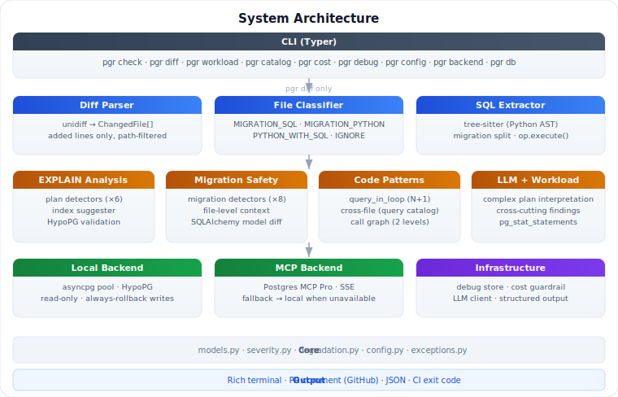
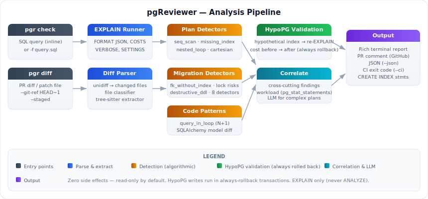
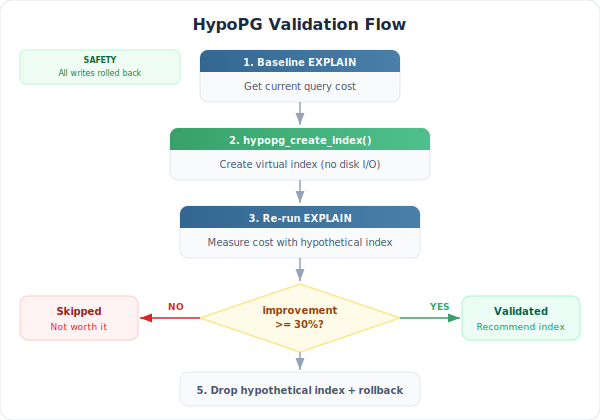
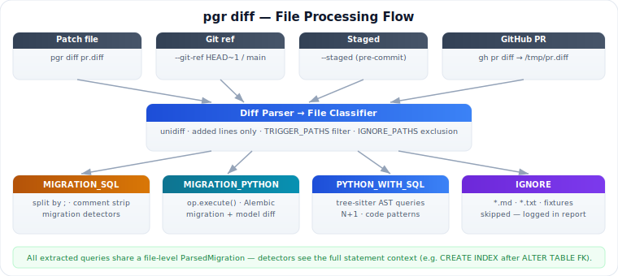
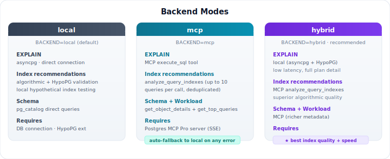

# Analysis Pipeline

  

pgReviewer runs two entry-point commands that share a common analysis engine:

- **`pgr check`** — analyze a single SQL query directly
- **`pgr diff`** — extract all SQL from a diff or git ref and analyze each statement

---

## pgr check pipeline

  

### 1. EXPLAIN runner

Executes `EXPLAIN (FORMAT JSON, COSTS true, VERBOSE true, SETTINGS true)` — never
`EXPLAIN ANALYZE`. No rows are read, no locks taken, no side effects.

### 2. Plan parser

Converts the raw PostgreSQL JSON into a typed `PlanNode` tree. `walk_nodes()` provides
a depth-first traversal used by all EXPLAIN-based detectors.

### 3. Schema collector

Queries `pg_class`, `pg_indexes`, and `pg_stats` to gather row estimates, existing
index definitions, and column statistics for every table in the plan. Results are
cached per run.

### 4. EXPLAIN detectors

Six pluggable detectors run against the plan tree and schema — see
[detectors.md](detectors.md) for the full reference.

### 5. Index suggester + HypoPG validation

  

For each detected issue, an index candidate is generated (equality → btree,
composite, partial, covering). Each candidate is validated with HypoPG:

1. `SELECT hypopg_create_index(...)` — creates a virtual index (no disk I/O)
2. Re-run `EXPLAIN` — measures cost with the hypothetical index in place
3. Roll back — the transaction is always discarded

Only candidates with **≥ 30% cost improvement** (configurable via
`HYPOPG_MIN_IMPROVEMENT`) are included in the output.

### 6. LLM interpretation (optional)

For complex plans — multi-join, CTEs, subqueries, or plans where detectors cannot
suggest a clear fix — an optional LLM step interprets the bottleneck and may
propose additional indexes (validated with HypoPG before inclusion).

Routing: simple plans never reach the LLM. If the LLM is unavailable or the
monthly budget is exhausted, the pipeline falls back to algorithmic analysis only.

---

## pgr diff pipeline

  

### 1. Diff parser

`unidiff` parses the unified diff into `ChangedFile` objects. Only added lines
are analyzed — deletions are skipped.

### 2. File classifier

Each changed file is classified as `MIGRATION_SQL`, `MIGRATION_PYTHON`,
`PYTHON_WITH_SQL`, or `IGNORE`. TRIGGER_PATHS and IGNORE_PATHS filters apply here.

### 3. SQL extractor

- **SQL files**: statements split by `;`, comment-stripped
- **Python files**: tree-sitter queries find `execute()`, `fetchrow()`, and
  similar call patterns; f-strings are flagged low-confidence

### 4. Migration safety detectors

Runs against the **full set of statements** in each source file — not one at a time.
This means `add_foreign_key_without_index` correctly sees `CREATE INDEX` statements
that appear later in the same migration and suppresses false positives.

### 5. Code pattern detectors

Tree-sitter-based detectors scan Python ASTs for queries inside loops
(`query_in_loop`) and cross-file N+1 patterns via the query catalog.

### 6. SQLAlchemy model diff

When a Python migration or model file changes, pgReviewer diffs the SQLAlchemy
model definitions between the base branch and the PR branch (via `git show`).

### 7. Cross-cutting findings

After all per-file analysis, `cross_correlator` links migration changes with query
issues in the same PR — for example, a column added in a migration that is then
queried in the same diff without an index.

### 8. Workload correlation

If `pg_stat_statements` data is available, changed queries are matched against known
slow queries. A query already in the slow-query workload gets its severity escalated;
a migration that drops an index used by slow queries triggers a CRITICAL warning.

---

## Deployment modes

  

| Mode | EXPLAIN | Index rec | Schema | Requires |
|---|---|---|---|---|
| `local` (default) | asyncpg | HypoPG | pg_catalog | DB connection |
| `mcp` | MCP Pro | MCP Pro | MCP Pro | Running MCP server |
| `hybrid` ★ | asyncpg | MCP Pro | MCP Pro | Both |

Set via `BACKEND=local|mcp|hybrid`. When the MCP backend is unavailable,
pgReviewer automatically falls back to `local` for that operation — analysis
always completes.

`hybrid` is recommended when a Postgres MCP Pro server is available: it combines
the low latency of a direct EXPLAIN connection with MCP Pro's workload-aware,
deduplicated index recommendations.

→ Full setup guide, GitHub Actions example, and fallback behaviour:
**[Postgres MCP Pro Integration](mcp-integration.md)**
