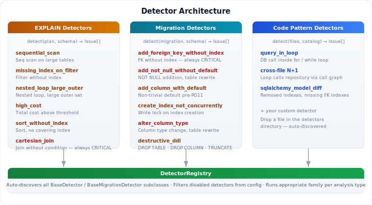

# Issue Detectors

pgReviewer uses a pluggable detector architecture to analyze `EXPLAIN` plans and identify performance issues.

<p align="center">
  
</p>

## Architecture

All detectors inherit from `BaseDetector` (ABC) and implement two things:

- `name` property — a unique identifier string
- `detect(plan, schema)` method — receives the parsed `ExplainPlan` and `SchemaInfo`, returns a list of `Issue` objects

The `DetectorRegistry` automatically discovers all `BaseDetector` subclasses in the `pgreviewer.analysis.issue_detectors` package. To disable a detector, add its name to the `DISABLED_DETECTORS` list in your `.env`.

## Built-in Detectors

### `sequential_scan`

**File:** `pgreviewer/analysis/issue_detectors/sequential_scan.py`

Flags sequential scans on tables with a significant number of rows, where an index scan would likely be more efficient.

| Condition | Severity |
|-----------|----------|
| Row estimate > `SEQ_SCAN_CRITICAL_THRESHOLD` (1M) | CRITICAL |
| Row estimate > `SEQ_SCAN_ROW_THRESHOLD` (10K) | WARNING |
| Below threshold | Not flagged |

**Configuration:** `SEQ_SCAN_ROW_THRESHOLD` (default: 10,000), `SEQ_SCAN_CRITICAL_THRESHOLD` (default: 1,000,000)

---

### `missing_index_on_filter`

**File:** `pgreviewer/analysis/issue_detectors/missing_index_on_filter.py`

Detects `Seq Scan` nodes that have a `Filter` condition but no supporting index on the filtered column(s). Cross-references `pg_indexes` to verify no existing index covers the filter.

| Condition | Severity |
|-----------|----------|
| Filter on column with no covering index | WARNING |

---

### `nested_loop_large_outer`

**File:** `pgreviewer/analysis/issue_detectors/nested_loop.py`

Flags nested loop joins where the outer relation has a large number of rows. Nested loops are O(n*m) — efficient for small outer sets but devastating for large ones.

| Condition | Severity |
|-----------|----------|
| Outer rows > 10K | CRITICAL |
| Outer rows > `NESTED_LOOP_OUTER_THRESHOLD` (1K) | WARNING |

**Configuration:** `NESTED_LOOP_OUTER_THRESHOLD` (default: 1,000)

---

### `high_cost`

**File:** `pgreviewer/analysis/issue_detectors/high_cost.py`

Flags queries where the total plan cost exceeds a configurable threshold, regardless of the specific operations involved.

| Condition | Severity |
|-----------|----------|
| Cost > `HIGH_COST_CRITICAL_THRESHOLD` (100K) | CRITICAL |
| Cost > `HIGH_COST_THRESHOLD` (10K) | WARNING |

**Configuration:** `HIGH_COST_THRESHOLD` (default: 10,000), `HIGH_COST_CRITICAL_THRESHOLD` (default: 100,000)

---

### `sort_without_index`

**File:** `pgreviewer/analysis/issue_detectors/sort_without_index.py`

Detects `Sort` nodes operating on more than 1,000 rows where the sort columns are not covered by an existing index on the source table.

| Condition | Severity |
|-----------|----------|
| Sort on >1K rows, no covering index | WARNING |

---

### `cartesian_join`

**File:** `pgreviewer/analysis/issue_detectors/cartesian_join.py`

Flags join nodes (`Nested Loop`, `Hash Join`, `Merge Join`) that lack a join condition — indicating a cross product. This is almost always a bug and always reported as CRITICAL.

| Condition | Severity |
|-----------|----------|
| Join without condition | CRITICAL |

## Writing a Custom Detector

Create a new Python file in `pgreviewer/analysis/issue_detectors/`:

```python
from pgreviewer.analysis.issue_detectors import BaseDetector
from pgreviewer.analysis.plan_parser import walk_nodes
from pgreviewer.core.models import ExplainPlan, Issue, Severity, SchemaInfo


class EstimateAccuracyDetector(BaseDetector):
    """Example: flag nodes where actual vs estimated rows differ significantly."""

    @property
    def name(self) -> str:
        return "estimate_accuracy"

    def detect(self, plan: ExplainPlan, schema: SchemaInfo) -> list[Issue]:
        issues = []
        for node in walk_nodes(plan):
            # Your detection logic here
            if node.plan_rows and node.plan_rows > 100_000:
                issues.append(
                    Issue(
                        severity=Severity.WARNING,
                        detector_name=self.name,
                        description=f"Large row estimate: {node.plan_rows:,} rows",
                        affected_table=node.relation_name,
                        affected_columns=[],
                        suggested_action="Consider reviewing table statistics",
                        confidence=0.8,
                        context={"plan_rows": node.plan_rows},
                    )
                )
        return issues
```

The detector is automatically discovered and will run on the next `pgr check`. No registration needed.

### Disabling Detectors

Add detector names to `DISABLED_DETECTORS` in your `.env`:

```
DISABLED_DETECTORS=["high_cost", "estimate_accuracy"]
```

## Issue Model

Each detector returns `Issue` objects:

| Field | Type | Description |
|-------|------|-------------|
| `severity` | `Severity` | `CRITICAL`, `WARNING`, or `INFO` |
| `detector_name` | `str` | Unique identifier of the detector |
| `description` | `str` | Human-readable description of the issue |
| `affected_table` | `str \| None` | Table involved, if applicable |
| `affected_columns` | `list[str]` | Columns involved, if applicable |
| `suggested_action` | `str` | Recommended fix |
| `confidence` | `float` | 0.0–1.0, how certain the detector is |
| `context` | `dict` | Detector-specific metadata for debugging |
